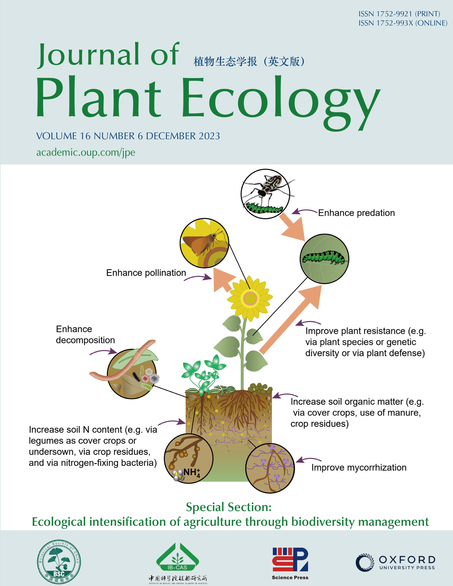

# Code for Buzhdygan & Petermann (2023) Journal of Plant Ecology

Code to reproduce the results for the systematic literature review in 
	
Oksana Y Buzhdygan, Jana S Petermann, Multitrophic biodiversity enhances ecosystem functions, services and ecological intensification in agriculture, Journal of Plant Ecology, Volume 16, Issue 6, December 2023, rtad019, https://doi.org/10.1093/jpe/rtad019  

Data source: 
Data to run this code and to support the conclusions of this study are published as Supplementary Data to this paper [Journal of Plant Ecology](https://academic.oup.com/jpe/article/16/6/rtad019/7177879)

Cover image:
The diagram shows how managing biodiversity and trophic interactions across the food web can enhance ecosystem functions and services in agricultural systems, leading to the ecological intensification of agriculture. The Images used to create the diagram are from Integration and Application Network (ian.umces.edu/media-library). See Buzhdygan & Petermann in this issue.
